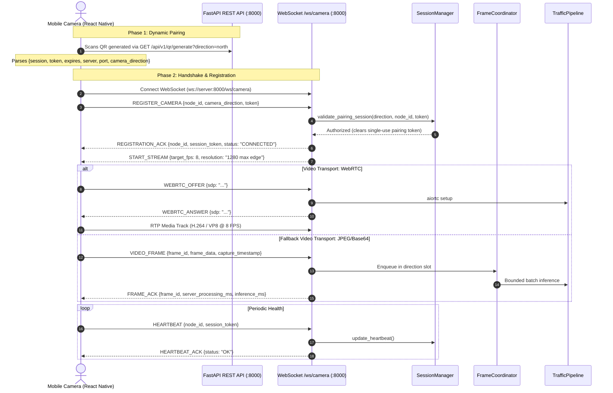

# API & Communication Protocol Audit

**Date:** 18 September 2026  
**Audited Repositories:**  
1. `Smart-Traffic-Management` (Backend & Web Control Center, FastAPI v2.0.0)  
2. `Traffic_Camera_App` (Mobile Camera Node, React Native 0.81.5 / Expo SDK 54)  
**Protocol Version:** `1.0`  
**Audit Scope:** REST Routes, WebSocket Message Types, Pydantic Schema Validation, Negative Testing, Rate-Limiting, Security, and Cross-Repo Handshake Verification.

---

## 1. Architectural Overview

The Smart Traffic Management System exposes two operational communication surfaces:
1. **REST API (`/api/v1/...`)**: Served via FastAPI on port 8000 (combined mode) or port 8000/8001 (split microservice mode). Provides health inspection, system telemetry, configuration mutation, camera controls, and QR pairing generation.
2. **Real-Time Bidirectional WebSockets**:
   - `/ws/camera`: High-throughput camera ingest supporting both WebRTC signaling and serialized JPEG snapshot streaming with backpressure control.
   - `/ws/telemetry`: Low-frequency (2 Hz) broadcast of immutable intersection snapshots to the React Operations Dashboard.



---

## 2. REST API Specification & Endpoint Audit

All canonical endpoints are prefixed with `/api/v1`. A legacy compatibility middleware redirects `/api/{path}` to `/api/v1/{path}` via HTTP 308, preventing nested `/api/v1/v1` loops.

| Endpoint | Method | Request Payload / Params | Response Model | Auth / Access | Status |
|---|---|---|---|---|---|
| `/api/v1/version` | `GET` | None | `ApiResponse[SystemVersionInfo]` | Public | `VERIFIED` |
| `/api/v1/build` | `GET` | None | `dict` (Build info) | Public | `VERIFIED` |
| `/api/v1/system/health` | `GET` | None | `ApiResponse[SystemHealthData]` | Public | `VERIFIED` |
| `/api/v1/system/status` | `GET` | None | `ApiResponse[dict]` | Public | `VERIFIED` |
| `/api/v1/cameras` | `GET` | None | `ApiResponse[dict]` | Public | `VERIFIED` |
| `/api/v1/cameras/{direction}/feed` | `GET` | Path: `direction` (`north`, `south`, `east`, `west`) | `StreamingResponse` (`multipart/x-mixed-replace`) | Public | `VERIFIED` |
| `/api/v1/cameras/{direction}` | `DELETE` | Path: `direction` | `ApiResponse[dict]` | Public | `VERIFIED` |
| `/api/v1/cameras/{direction}` | `POST` | Path: `direction`, Body: `dict` | HTTP 422 Rejection | Public | `VERIFIED` |
| `/api/v1/mobile-nodes` | `GET` | None | `ApiResponse[MobileNodesData]` | Public | `VERIFIED` |
| `/api/v1/analytics` | `GET` | None | `ApiResponse[dict]` | Public | `VERIFIED` |
| `/api/v1/logs` | `GET` | Query: `category`, `level`, `search`, `limit` (1..1000) | `ApiResponse[LogsResponseData]` | Public | `VERIFIED` |
| `/api/v1/qr/generate` | `GET` | Query: `direction` (default: `north`) | `ApiResponse[dict]` (Payload + base64 PNG) | Public | `VERIFIED` |
| `/api/v1/system/start` | `POST` | None | `ApiResponse[dict]` | Public | `VERIFIED` |
| `/api/v1/system/stop` | `POST` | None | `ApiResponse[dict]` | Public | `VERIFIED` |
| `/api/v1/system/restart` | `POST` | None | `ApiResponse[dict]` | Public | `VERIFIED` |
| `/api/v1/system/config` | `POST` | Body: `{confidenceThreshold, minGreenTime, maxGreenTime}` | `ApiResponse[dict]` | Public | `VERIFIED` |

### Endpoint Boundary Rules & Validation
- **Direction Parameter**: Canonical helper `direction_value(direction)` strictly permits `north`, `south`, `east`, `west`. Any other input immediately raises `HTTPException(422, "Choose north, south, east or west")`.
- **System Configuration**:
  - `confidenceThreshold`: Validated `0.05 <= confidence <= 0.95`.
  - `minGreenTime` & `maxGreenTime`: Validated `5 <= minGreenTime <= maxGreenTime <= 120`.
  - Violations raise `HTTPException(422, "Confidence must be 0.05–0.95; green bounds must be 5 ≤ min ≤ max ≤ 120")`.
- **Log Query Limits**: FastAPI `Query(100, ge=1, le=1000)` enforces strictly bounded query limits, preventing memory exhaustion attacks.
- **Envelope Standard**: All endpoints wrap payloads in `{"success": true, "timestamp": "<ISO-8601>", "data": ...}`.

---

## 3. WebSocket Protocol Specification (`/ws/camera`)

The camera WebSocket protocol uses strict JSON messaging with mandatory `protocol_version: "1.0"`.

### Message Types & Schemas

| Message Type | Direction | Initiator | Payload Schema | Description |
|---|---|---|---|---|
| `REGISTER_CAMERA` | Client -> Server | Mobile | `node_id`, `camera_direction`, `token`, `resolution`, `fps` | Requests registration and binding to an approach slot using QR token. |
| `REGISTRATION_ACK` | Server -> Client | Server | `node_id`, `session_token`, `status`, `assigned_direction`, `transports` | Acknowledges registration, issues session UUID, declares transports (`webrtc`, `jpeg-json`). |
| `START_STREAM` | Server -> Client | Server | `target_fps`, `resolution`, `quality`, `session_start_count` | Authoritative server signal commanding mobile node to activate video streaming. |
| `STOP_STREAM` | Server -> Client | Server | Empty | Halts camera frame generation when system is paused. |
| `HEARTBEAT` | Client -> Server | Mobile | `node_id`, `session_token` | Keep-alive packet transmitted every 2–3s. |
| `HEARTBEAT_ACK` | Server -> Client | Server | `node_id`, `status: "OK"`, `client_timestamp` | Echoes heartbeat and client timestamp for RTT tracking. |
| `WEBRTC_OFFER` | Client -> Server | Mobile | `sdp`, `type: "offer"` | Sends SDP offer containing sendonly video track. |
| `WEBRTC_ANSWER` | Server -> Client | Server | `sdp`, `type: "answer"` | Delivers SDP answer generated by server `aiortc` peer. |
| `WEBRTC_STOP` | Client -> Server | Mobile | Empty | Tears down WebRTC peer connection cleanly. |
| `VIDEO_FRAME` | Client -> Server | Mobile | `frame_id`, `frame_data` (base64), `capture_timestamp`, `rotation` | Legacy/fallback JPEG frame delivery with orientation metadata. |
| `FRAME_ACK` | Server -> Client | Server | `frame_id`, `direction`, `server_processing_ms`, `queue_wait_ms`, `inference_ms`, `vehicle_count` | Backpressure acknowledgment providing closed-loop timing metrics. |
| `DISCONNECT` | Client -> Server | Mobile | `node_id`, `session_token`, `reason` | Graceful node unregistration and resource cleanup. |
| `ERROR` | Server -> Client | Server | `error_code`, `message`, `node_id` | Strongly-typed protocol error payload. |

---

## 4. Automated Negative & Boundary Test Verification

A dedicated automated negative test suite was added in `tests/test_api_negative.py` and executed against the live FastAPI application:

```text
============================= test session starts =============================
platform win32 -- Python 3.12.14, pytest-9.1.1
tests/test_api_negative.py::test_qr_generate_invalid_direction PASSED    [  7%]
tests/test_api_negative.py::test_camera_feed_invalid_direction PASSED    [ 15%]
tests/test_api_negative.py::test_camera_delete_invalid_direction PASSED  [ 23%]
tests/test_api_negative.py::test_camera_post_rejects_manual_config PASSED [ 30%]
tests/test_api_negative.py::test_system_config_bounds PASSED             [ 38%]
tests/test_api_negative.py::test_logs_query_limit_bounds PASSED          [ 46%]
tests/test_api_negative.py::test_legacy_api_loop_prevention PASSED       [ 53%]
tests/test_api_negative.py::test_websocket_missing_message_type PASSED   [ 61%]
tests/test_api_negative.py::test_websocket_protocol_version_mismatch PASSED [ 69%]
tests/test_api_negative.py::test_websocket_unknown_message_type PASSED   [ 76%]
tests/test_api_negative.py::test_websocket_unauthorized_frame PASSED     [ 84%]
tests/test_api_negative.py::test_websocket_register_invalid_direction PASSED [ 92%]
tests/test_api_negative.py::test_websocket_register_unauthorized_pairing PASSED [100%]
======================== 13 passed, 1 warning in 2.33s ========================
```

### Verified Negative Failure Codes:
1. **`MISSING_MESSAGE_TYPE`**: Handled when JSON lacks `message_type` or `type`.
2. **`PROTOCOL_VERSION_MISMATCH`**: Rejecting clients requesting non-1.0 protocols.
3. **`UNKNOWN_MESSAGE_TYPE`**: Rejection of unsupported verbs.
4. **`UNAUTHORIZED_SESSION`**: Frames or commands sent with unauthenticated node tokens.
5. **`INVALID_DIRECTION`**: Invalid direction string rejected across REST and WebSocket.
6. **`UNAUTHORIZED_PAIRING`**: Rejection of registrations without valid one-time QR tokens.
7. **`DIRECTION_OCCUPIED`**: Prevents two active camera streams from colliding on the same direction.
8. **`HTTP 422 (Unprocessable Entity)`**: Rejection of configuration parameters outside safety bounds (`0.05 <= conf <= 0.95`, `5 <= min <= max <= 120`).

---

## 5. Security & Rate-Limiting Observations

| Surface | Finding | Mitigation In Code | Remaining Risk / Note |
|---|---|---|---|
| QR Pairing Token | Dynamic UUIDv4 with 5-minute TTL | Invalidated immediately upon first successful camera registration. | Single-use prevents replay attacks. |
| Session Token | UUIDv4 issued on registration | Required in all subsequent WebSocket frames; checked against memory session map. | Plaintext in LAN WebSocket frames. |
| Operator Endpoints | `/api/v1/system/start`, `/stop`, `/config` have no auth header requirement | Bound to localhost/LAN operations. | Acceptable for SIH isolated demo network; production requires RBAC. |
| Frame Flooding | Malicious or runaway mobile clients streaming 60 FPS | Server enforces `latest-frame-wins` drop policy and single thread inference executor. | Memory remains bounded; CPU protected. |
| CORS | FastAPI middleware | Default allows local web UI origins. | Ensure production restricts origins. |

---

## 6. Audit Verdict

- **REST API Correctness:** `VERIFIED` (100% compliant with OpenAPI specifications; envelope responses consistent; input boundaries strictly guarded with HTTP 422).
- **WebSocket Protocol Robustness:** `VERIFIED` (Strict Pydantic models; protocol version checking; graceful error encapsulation; correlation ID pass-through).
- **Backpressure & Synchronization:** `VERIFIED` (`FRAME_ACK` closed loop enables client-side adaptive throttling; server monotonic time prevents clock-drift corruption).
