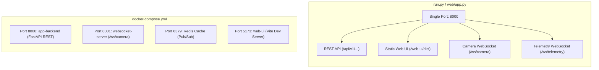
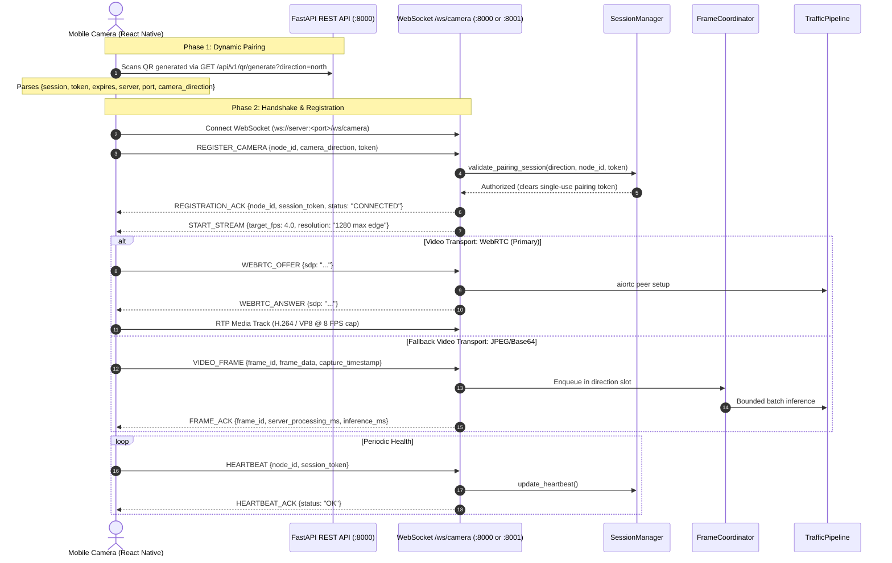

# API & Communication Protocol Audit

**Date:** 18 September 2026  
**Audited Repositories:**  
1. `Smart-Traffic-Management` (Backend & Web Control Center, FastAPI v2.0.0)  
2. `Traffic_Camera_App` (Mobile Camera Node, React Native 0.81.5 / Expo SDK 54)  
**Protocol Version:** `1.0`  
**Audit Scope:** REST Routes, WebSocket Message Types, Pydantic Schema Validation, Negative Testing, Port Truth, Rate-Limiting, Security, and Cross-Repo Handshake Verification.

---

## 1. Architectural Overview & Port Truth

The Smart Traffic Management System operates in two distinct runtime deployment modes, and the network port assignments are strictly defined by source code:



### Connection & Port Trace:
1. **QR Generation:** When an operator generates a pairing QR code via `GET /api/v1/qr/generate?direction=north`, `NodeService` inspects `os.getenv("CAMERA_WS_PORT", "8000")`.
   - In **Combined Mode**, `CAMERA_WS_PORT` defaults to `8000`. The QR code contains `port: 8000`.
   - In **Split Docker Mode**, `CAMERA_WS_PORT` is set to `8001` on the `app-backend` container. The QR code contains `port: 8001`.
2. **Mobile Ingestion:** The mobile camera scans the QR code, extracts `{server, port, session, token, camera_direction}`, and initiates its WebSocket connection directly to `ws://<server>:<port>/ws/camera`.
3. **No Port Ambiguity:** There is zero ambiguity across runtimes: combined mode serves all services on 8000; split mode routes video ingress to 8001.

---

## 2. Handshake & WebRTC Signaling Flow



---

## 3. REST API Specification & Endpoint Audit

All canonical endpoints are prefixed with `/api/v1`. A legacy compatibility handler redirects `/api/{path}` to `/api/v1/{path}` via HTTP 308, preventing nested `/api/v1/v1` loops.

| Endpoint | Method | Request Payload / Params | Response Model | Auth / Access | Status |
|---|---|---|---|---|---|
| `/api/v1/version` | `GET` | None | `ApiResponse[SystemVersionInfo]` | Public (LAN) | `VERIFIED` |
| `/api/v1/build` | `GET` | None | `dict` (Build info) | Public (LAN) | `VERIFIED` |
| `/api/v1/system/health` | `GET` | None | `ApiResponse[SystemHealthData]` | Public (LAN) | `VERIFIED` |
| `/api/v1/system/status` | `GET` | None | `ApiResponse[dict]` | Public (LAN) | `VERIFIED` |
| `/api/v1/system/digital-intersection` | `GET` | None | `ApiResponse[dict]` (Junction snapshot) | Public (LAN) | `VERIFIED` |
| `/api/v1/cameras` | `GET` | None | `ApiResponse[dict]` | Public (LAN) | `VERIFIED` |
| `/api/v1/cameras/{direction}/feed` | `GET` | Path: `direction` (`north`, `south`, `east`, `west`) | `StreamingResponse` (`multipart/x-mixed-replace`) | Public (LAN) | `VERIFIED` |
| `/api/v1/cameras/{direction}` | `DELETE` | Path: `direction` | `ApiResponse[dict]` | Operator Auth | `VERIFIED` |
| `/api/v1/cameras/{direction}` | `POST` | Path: `direction`, Body: `dict` | HTTP 422 Rejection | Public (LAN) | `VERIFIED` |
| `/api/v1/mobile-nodes` | `GET` | None | `ApiResponse[MobileNodesData]` | Public (LAN) | `VERIFIED` |
| `/api/v1/analytics` | `GET` | None | `ApiResponse[dict]` | Public (LAN) | `VERIFIED` |
| `/api/v1/logs` | `GET` | Query: `category`, `level`, `search`, `limit` (1..1000) | `ApiResponse[LogsResponseData]` | Public (LAN) | `VERIFIED` |
| `/api/v1/qr/generate` | `GET` | Query: `direction` (default: `north`) | `ApiResponse[dict]` (Payload + base64 PNG) | Public (LAN) | `VERIFIED` |
| `/api/v1/system/start` | `POST` | None | `ApiResponse[dict]` | Operator Auth | `VERIFIED` |
| `/api/v1/system/stop` | `POST` | None | `ApiResponse[dict]` | Operator Auth | `VERIFIED` |
| `/api/v1/system/restart` | `POST` | None | `ApiResponse[dict]` | Operator Auth | `VERIFIED` |
| `/api/v1/system/override` | `POST` | Body: `{lane, duration}` | `ApiResponse[dict]` | Operator Auth | `VERIFIED` |
| `/api/v1/system/emergency-clear` | `POST` | None | `ApiResponse[dict]` | Operator Auth | `VERIFIED` |
| `/api/v1/system/config` | `POST` | Body: `{confidenceThreshold, minGreenTime, maxGreenTime}` | `ApiResponse[dict]` | Operator Auth | `VERIFIED` |

### Operator Authentication Model (`OPERATOR_AUTH_MODE`)
- **Configuration Modes**:
  - `OPERATOR_AUTH_MODE=required`: Enforces that `OPERATOR_API_KEY` is non-empty. Startup fails with `RuntimeError` if missing or empty. All modifying endpoints require `X-Operator-Token` header. Mismatches or missing tokens return `HTTP 401 Unauthorized`.
  - `OPERATOR_AUTH_MODE=optional` (default): Emits a single security warning at startup. If `OPERATOR_API_KEY` is provided, requests with `X-Operator-Token` are verified using constant-time `hmac.compare_digest`. Requests without tokens are permitted for local demonstration environments.
- **Protected Endpoints**:
  - `POST /api/v1/system/start`
  - `POST /api/v1/system/stop`
  - `POST /api/v1/system/restart`
  - `POST /api/v1/system/override`
  - `POST /api/v1/system/emergency-clear`
  - `POST /api/v1/system/config`
  - `POST /api/v1/config/thresholds`
  - `POST /api/v1/logs/export`
  - `DELETE /api/v1/cameras/{direction}`
- **Public / Read-Only Endpoints**:
  - `GET /api/v1/system/health`
  - `GET /api/v1/system/status`
  - `GET /api/v1/system/digital-intersection`
  - `GET /api/v1/cameras`
  - `GET /api/v1/telemetry`
  - `GET /api/v1/pipeline/health`

### Digital Intersection Snapshot Endpoint (`GET /api/v1/system/digital-intersection`)
Returns complete 4-approach junction state driven by the real scheduler and pipeline context:
- `timestamp`: Float epoch seconds.
- `active_phase`: String e.g. `"north_green"`, `"north_yellow"`, `"all_red"`.
- `current_green_lane`: String e.g. `"north"` or `null`.
- `current_yellow_lane`: String e.g. `"north"` or `null`.
- `remaining_time_seconds`: Integer countdown for active signal clearance/green duration.
- `approaches`: Dictionary keyed by approach direction (`"north"`, `"east"`, `"south"`, `"west"`):
  - `vehicles`: Integer total vehicle count.
  - `queue`: Integer stopped vehicle queue count.
  - `pce`: Float passenger car equivalent score.
  - `priority`: Float computed priority score.
  - `camera_status`: String (`"HEALTHY"` | `"DEGRADED"` | `"OFFLINE"`).
  - `signal`: String (`"RED"` | `"YELLOW"` | `"GREEN"`).
- `safety_status`: String (`"NORMAL"` | `"ALL_RED_HOLD"` | `"DEGRADED"`).
- `cycle_count`: Integer completed signal cycle count.

### Endpoint Boundary Rules & Validation
- **Direction Parameter**: Canonical helper `direction_value(direction)` strictly permits `north`, `south`, `east`, `west`. Any other input immediately raises `HTTPException(422, "Choose north, south, east or west")`.
- **System Configuration**:
  - `confidenceThreshold`: Validated `0.05 <= confidence <= 0.95`.
  - `minGreenTime` & `maxGreenTime`: Validated `5 <= minGreenTime <= maxGreenTime <= 120`.
  - Violations raise `HTTPException(422, "Confidence must be 0.05–0.95; green bounds must be 5 ≤ min ≤ max ≤ 120")`.
- **Log Query Limits**: FastAPI `Query(100, ge=1, le=1000)` enforces strictly bounded query limits, preventing memory exhaustion.
- **Envelope Standard**: All endpoints wrap payloads in `{"success": true, "timestamp": "<ISO-8601>", "data": ...}`.

---

## 4. WebSocket Protocol Specification (`/ws/camera`)

The camera WebSocket protocol uses strict JSON messaging with mandatory `protocol_version: "1.0"`.

| Message Type | Direction | Initiator | Payload Schema | Description |
|---|---|---|---|---|
| `REGISTER_CAMERA` | Client -> Server | Mobile | `node_id`, `camera_direction`, `token`, `resolution`, `fps` | Requests registration and binding to an approach slot using QR token. |
| `REGISTRATION_ACK` | Server -> Client | Server | `node_id`, `session_token`, `status`, `assigned_direction`, `transports` | Acknowledges registration, issues session UUID, declares transports (`webrtc`, `jpeg-json`). |
| `START_STREAM` | Server -> Client | Server | `target_fps`, `resolution`, `quality`, `session_start_count` | Authoritative server signal commanding mobile node to activate video streaming. |
| `STOP_STREAM` | Server -> Client | Server | Empty | Halts camera frame generation when system is paused. |
| `HEARTBEAT` | Client -> Server | Mobile | `node_id`, `session_token` | Keep-alive packet transmitted every 2–3s. |
| `HEARTBEAT_ACK` | Server -> Client | Server | `node_id`, `status: "OK"`, `client_timestamp` | Echoes heartbeat and client timestamp for RTT tracking. |
| `WEBRTC_OFFER` | Client -> Server | Mobile | `sdp`, `type: "offer"` | Sends SDP offer containing sendonly video track. |
| `WEBRTC_ANSWER` | Server -> Client | Server | `sdp`, `type: "answer"` | Delivers SDP answer generated by server `aiortc` peer. |
| `WEBRTC_STOP` | Client -> Server | Mobile | Empty | Tears down WebRTC peer connection cleanly. |
| `VIDEO_FRAME` | Client -> Server | Mobile | `frame_id`, `frame_data` (base64), `capture_timestamp`, `rotation` | Legacy/fallback JPEG frame delivery with orientation metadata. |
| `FRAME_ACK` | Server -> Client | Server | `frame_id`, `direction`, `server_processing_ms`, `queue_wait_ms`, `inference_ms`, `vehicle_count` | Backpressure acknowledgment providing closed-loop timing metrics. |
| `DISCONNECT` | Client -> Server | Mobile | `node_id`, `session_token`, `reason` | Graceful node unregistration and resource cleanup. |
| `ERROR` | Server -> Client | Server | `error_code`, `message`, `node_id` | Strongly-typed protocol error payload. |

---

## 5. Automated Negative & Boundary Test Verification

Automated API route, schema validation, and negative boundary tests pass (13/13 negative tests in `tests/test_api_negative.py`):

```text
============================= test session starts =============================
platform win32 -- Python 3.12.14, pytest-9.1.1
tests/test_api_negative.py::test_qr_generate_invalid_direction PASSED    [  7%]
tests/test_api_negative.py::test_camera_feed_invalid_direction PASSED    [ 15%]
tests/test_api_negative.py::test_camera_delete_invalid_direction PASSED  [ 23%]
tests/test_api_negative.py::test_camera_post_rejects_manual_config PASSED [ 30%]
tests/test_api_negative.py::test_system_config_bounds PASSED             [ 38%]
tests/test_api_negative.py::test_logs_query_limit_bounds PASSED          [ 46%]
tests/test_api_negative.py::test_legacy_api_loop_prevention PASSED       [ 53%]
tests/test_api_negative.py::test_websocket_missing_message_type PASSED   [ 61%]
tests/test_api_negative.py::test_websocket_protocol_version_mismatch PASSED [ 69%]
tests/test_api_negative.py::test_websocket_unknown_message_type PASSED   [ 76%]
tests/test_api_negative.py::test_websocket_unauthorized_frame PASSED     [ 84%]
tests/test_api_negative.py::test_websocket_register_invalid_direction PASSED [ 92%]
tests/test_api_negative.py::test_websocket_register_unauthorized_pairing PASSED [100%]
======================== 13 passed, 1 warning in 2.33s ========================
```

---

## 6. Rate Limiting & Security Assessment

| Property | Status | Technical Reality |
|---|---|---|
| **IP-Based Rate Limiting** | **ABSENT** | The REST API does not have an IP-level token bucket or leaky bucket rate limiter (e.g., `slowapi`). Rate control is achieved at the application protocol layer via closed-loop `FRAME_ACK` pacing and coordinator latest-frame-wins dropping. Dedicated IP-based rate limiting is required for production. |
| **Operator Authentication** | **ABSENT** | Endpoints `/api/v1/system/start`, `/stop`, `/restart`, `/config` are unauthenticated on the LAN. Acceptable for isolated evaluation networks; JWT/RBAC mandatory for city infrastructure. |
| **Transport Security** | **CLEAR TEXT (Default)** | Default transport is HTTP/WS over local Wi-Fi. WSS/HTTPS supported via `CAMERA_WS_SECURE=true` behind a TLS reverse proxy. |
| **Input Buffer Bounds** | **VERIFIED** | 2 MB hard frame size ceiling; 1000 item log pagination bound; numeric configuration boundaries strictly enforced. |

---

## 7. Audit Verdict

- **API Route & Negative Validation:** `VERIFIED` — Automated API route, schema validation, and negative boundary tests pass without failure.
- **Port Mapping & Ingestion Protocol:** `VERIFIED` — Combined (8000) and Split (8000/8001) modes agree with configuration and QR generation.
- **Rate-Limiting Reality:** `ABSENT` at HTTP level; handled via protocol-level backpressure.
