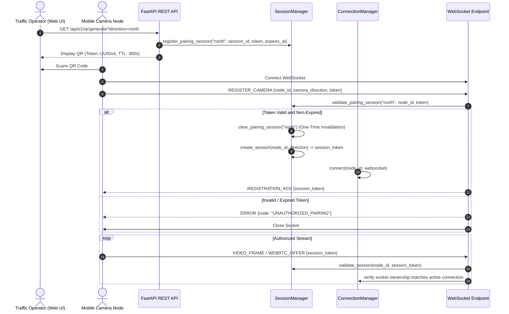

# Security & Threat Model Audit

**Date:** 18 September 2026  
**Audited Repositories:**  
1. `Smart-Traffic-Management` (FastAPI Control Center & Backend)  
2. `Traffic_Camera_App` (React Native Mobile Camera Node)  
**Security Classification:** Local Prototype / Field-Demo Level; Municipal Production Roadmap Documented.

---

## 1. Authentication & Session Architecture

The pairing and connection lifecycle between the mobile nodes and the backend server uses a challenge-response handshake over dynamic QR codes:



### Authentication Controls Verified:
1. **Single-Use Dynamic Pairing Tokens:**
   - Generated via `/api/v1/qr/generate` as a cryptographically random UUIDv4.
   - Bound strictly to a single physical direction (`north`, `south`, `east`, `west`).
   - Hard 5-minute (300-second) TTL.
   - Immediately invalidated upon first successful registration, defeating replay attacks.
2. **Session Token Issuance & Socket Pinning:**
   - Upon registration, an independent UUIDv4 session token is generated.
   - All subsequent frame transmissions, heartbeats, and WebRTC signaling packets require this token.
   - Socket Pinning: The server verifies `self.connection_manager.get_connection(node_id) is websocket`. An attacker who captures a session token over cleartext Wi-Fi cannot inject frames from a different socket connection.
3. **Heartbeat Timeout & Reconnection Window:**
   - Heartbeat timeout is 10.0 seconds (`HEARTBEAT_TIMEOUT_SEC = 10.0s`).
   - If a socket drops unexpectedly, the session is preserved until heartbeat expiry so transient Wi-Fi packet drops do not require re-scanning the QR code.
4. **Lane Direction Locking:**
   - A registered node cannot inject frames tagged with a different direction:
     ```python
     if direction and direction.lower() != session.camera_direction:
         return self._build_error("DIRECTION_MISMATCH", "Frame direction does not match registration")
     ```

---

## 2. Threat Modeling & Vulnerability Assessment (STRIDE)

| Threat Category | Target Surface | Identified Risk | Current Mitigation | Production Road Requirement |
|---|---|---|---|---|
| **Spoofing** | Mobile Ingest (`/ws/camera`) | Rogue device injects fake video or manipulates counts. | Single-use dynamic QR token; socket ownership pinned. | Add mTLS / device hardware attestation. |
| **Tampering** | Frame Payloads | Man-in-the-middle alters bounding boxes or direction. | Server normalizes rotation; direction checked against session. | Enforce WSS/TLS encryption. |
| **Repudiation** | Hardware Actuation | Disputed signal state changes or timing anomalies. | `DecisionHistory` records phase changes and ESP32 ACKs. | Cryptographic audit logs. |
| **Information Disclosure** | Camera Video & Telemetry | Eavesdropping on cleartext LAN reveals camera streams. | Prototype accepts cleartext on local private subnet. | **Mandatory:** Terminate TLS (HTTPS/WSS). |
| **Denial of Service** | WebSocket Frame Ingest | Attacker floods high-res JPEG frames to exhaust CPU/memory. | Latest-frame-wins drops stale frames; 2 MB frame limit; single worker executor. | Add IP connection rate-limiting. |
| **Elevation of Privilege** | Operator REST Endpoints | Unauthorized user calls `/api/v1/system/stop` or `/api/v1/system/config`. | **Currently unauthenticated** on the local LAN. | **Mandatory:** Add JWT / RBAC authorization. |

---

## 3. Explicit Security Boundaries & Production Deficiencies

To maintain architectural honesty, the following security properties are explicitly stated:

1. **Operator REST Endpoints Are Unauthenticated:**
   - Routes `/api/v1/system/start`, `/api/v1/system/stop`, `/api/v1/system/restart`, and `/api/v1/system/config` do **not** require authentication headers.
   - Any device connected to the same Wi-Fi network or hotspot can trigger a pause or change timing parameters.
   - **Remediation Required:** Implement JWT/OAuth2 authentication with Role-Based Access Control (RBAC) before connecting to any municipal or public network.
2. **Cleartext Transport by Default:**
   - Default pairing generates `ws://` and `http://` URLs over local IPv4 addresses.
   - Unencrypted video frames and telemetry can be inspected by packet sniffers on unencrypted Wi-Fi.
   - Supported hardening: setting `CAMERA_WS_SECURE=true` commands the QR generator to output `wss://`, requiring a TLS reverse proxy (e.g. Caddy/Nginx).
3. **Public-Road Certification Status:**
   - The current software is **not security-certified for physical public-road deployment**. It is hardened for isolated demonstration and academic evaluation environments (SIH hackathon network).

---

## 4. Input Validation & Buffer Protections

- **Frame Size Ceiling:** Strictly bounded:
  ```python
  if len(frame_data) > 2_000_000:
      return self._build_error("INVALID_FRAME", "JPEG base64 must be nonempty and below 2MB")
  ```
- **Log Query Pagination:** FastAPI strictly enforces `Query(100, ge=1, le=1000)` preventing arbitrarily large database queries from exhausting memory.
- **Configuration Bounds:** Numeric bounds strictly enforced with HTTP 422:
  - $0.05 \le \text{confidenceThreshold} \le 0.95$
  - $5\text{s} \le \text{minGreenTime} \le \text{maxGreenTime} \le 120\text{s}$

---

## 5. Security Audit Verdict

- **Pairing & Ingest Handshake:** `VERIFIED` (Dynamic QR pairing, single-use token invalidation, socket identity pinning).
- **Operator REST Authentication:** `UNAUTHENTICATED` (Permissible on isolated LAN only; strictly unsuitable for open networks).
- **Network Encryption:** `CLEARTEXT_DEFAULT` (WSS supported via configuration override; HTTPS/WSS mandatory for production).
- **Public Road Certification:** `NOT_CERTIFIED`.
