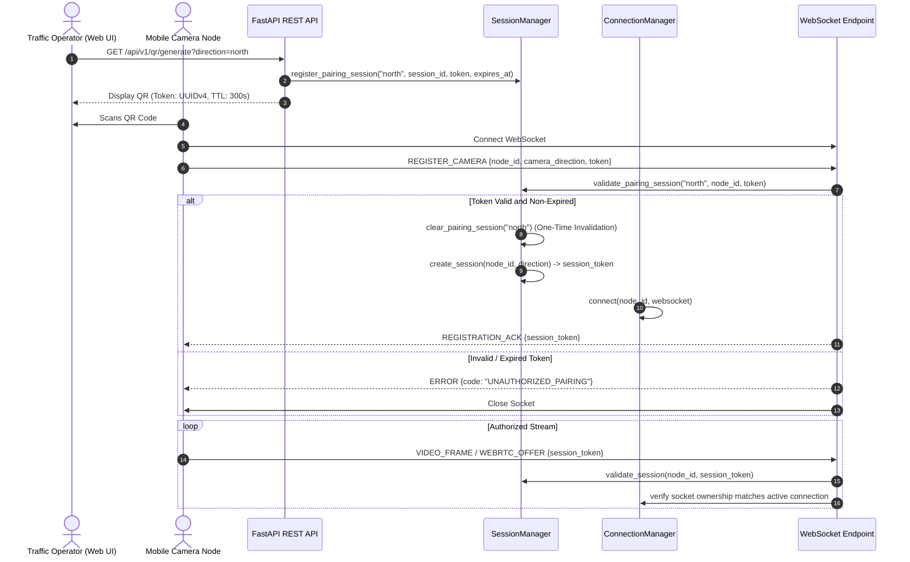

# Security & Threat Model Audit

**Date:** 18 September 2026  
**Audited Repositories:**  
1. `Smart-Traffic-Management` (FastAPI Control Center & Backend)  
2. `Traffic_Camera_App` (React Native Mobile Camera Node)  
**Security Classification:** Development / Field-Demo Prototype Hardened (SIH Level); Production Road Requirements Documented.

---

## 1. Authentication & Session Architecture

The pairing and connection lifecycle between the mobile nodes and the backend server uses a multi-stage authentication handshake:



### Authentication Controls Verified:
1. **Single-Use Dynamic Pairing Tokens:**
   - Generated via `/api/v1/qr/generate` as a cryptographically random UUIDv4.
   - Bound strictly to a single physical direction (`north`, `south`, `east`, `west`).
   - Hard 5-minute (300-second) TTL.
   - Immediately invalidated upon first successful registration, defeating replay attacks.
2. **Session Token Issuance:**
   - Upon registration, an independent UUIDv4 session token is generated.
   - All subsequent frame transmissions, heartbeats, and WebRTC signaling packets require this token.
3. **Socket Ownership Pinning:**
   - In addition to token validation, the server verifies `self.connection_manager.get_connection(node_id) is websocket`. An attacker who captures a valid session token cannot inject frames from a different TCP connection.
4. **Lane Direction Locking:**
   - A registered node cannot inject frames tagged with a different direction:
     ```python
     if direction and direction.lower() != session.camera_direction:
         return self._build_error("DIRECTION_MISMATCH", "Frame direction does not match registration")
     ```
   - Two nodes cannot occupy the same direction simultaneously without eviction.

---

## 2. Threat Modeling & Vulnerability Assessment (STRIDE)

| Threat Category | Target Surface | Identified Risk | Mitigation In Code | Severity |
|---|---|---|---|---|
| **Spoofing** | Mobile Ingest (`/ws/camera`) | Rogue device injects fake vehicle video or clears traffic lights. | Pairing requires physical scanning of single-use dynamic QR token; socket ownership pinned. | Medium (Low on Hotspot) |
| **Tampering** | Frame Payloads | Man-in-the-middle modifies vehicle coordinates or direction. | Frame orientation normalized on server; direction validated against server-side session registry. | Low |
| **Repudiation** | Hardware Actuation | Disputed signal state changes or timing anomalies. | `DecisionHistory` and CSV/JSON loggers record every phase change, winner reason, and ESP32 ACK. | Low |
| **Information Disclosure** | Camera Video & Telemetry | Eavesdropping on public/unsecured Wi-Fi reveals camera streams. | Prototype uses unencrypted HTTP/WS by default. WSS/HTTPS supported via `CAMERA_WS_SECURE=true`. | Medium |
| **Denial of Service** | WebSocket Frame Ingest | Attacker floods 100 FPS high-resolution JPEG frames to exhaust CPU/memory. | Single frame worker executor; latest-frame-wins drops stale queues; 2 MB frame size limit enforced. | Low |
| **Elevation of Privilege** | Operator REST Endpoints | Unauthorized user calls `/api/v1/system/stop` or `/api/v1/system/config`. | Currently unauthenticated on LAN; acceptable for hackathon/isolated network, unsafe for open Internet. | High (for public deployment) |

---

## 3. Detailed Attack Surface Analysis

### 3.1 Operator REST Endpoints
- **Current State:** Endpoints `/api/v1/system/start`, `/api/v1/system/stop`, `/api/v1/system/restart`, and `/api/v1/system/config` do not demand an `Authorization: Bearer <token>` header.
- **Risk Evaluation:**
  - In the SIH demonstration environment (Windows Mobile Hotspot or dedicated router), only connected evaluation devices have IP reachability.
  - In a smart-city municipal network, this would represent a critical risk.
- **Recommendation:** Integrate OAuth2 / JWT authentication with role-based access control (Operator vs. Viewer) for production road deployment.

### 3.2 Cleartext vs. TLS Transport
- **Current State:** Default pairing generates `ws://` links over local IPv4 addresses (e.g. `192.168.137.1:8000`).
- **Available Hardening:**
  - Environment variable `CAMERA_WS_SECURE=true` commands the QR generator to output `wss://` payloads.
  - Reverse proxy (Nginx or Caddy) can terminate TLS at edge with self-signed or Let's Encrypt certificates.
  - Android network security config (`plugins/withTrustedLan.js`) allows cleartext traffic only for private RFC 1918 subnets (`192.168.x.x`, `10.x.x.x`, `172.16-31.x.x`).

### 3.3 Buffer Exhaustion & Input Fuzzing
- **Frame Size Guard:** Non-empty string check and explicit boundary:
  ```python
  if len(frame_data) > 2_000_000:
      return self._build_error("INVALID_FRAME", "JPEG base64 must be nonempty and below 2MB")
  ```
- **Log Query Pagination:** FastAPI strictly enforces `Query(100, ge=1, le=1000)` preventing arbitrarily large database queries from exhausting memory.
- **Configuration Bounds:** Numeric bounds strictly enforced with HTTP 422:
  - $0.05 \le \text{confidenceThreshold} \le 0.95$
  - $5\text{s} \le \text{minGreenTime} \le \text{maxGreenTime} \le 120\text{s}$

---

## 4. Hardware Safety & Serial Isolation

- **PySerial Buffer Protection:** The `ESP32Interface` uses non-blocking serial writes (`timeout=0.1`) and sanitizes command strings using regex/strict ASCII encoders (`CommandEncoder`).
- **Fail-Closed Principle:**
  - If physical hardware mode (`HARDWARE=esp32`) is selected but the serial port disconnects or fails to respond with ACKs, the runtime **halts automatic phase transitions** and transitions the intersection to safe `ALL_RED`.
  - The runtime never silently falls back to simulation mode when physical hardware was explicitly requested.

---

## 5. Security Audit Verdict

| Criteria | Prototype Status | SIH Readiness | Production Hardening Needed |
|---|---|---|---|
| Camera Pairing Security | `VERIFIED` | Ready | Add HMAC signatures to QR payloads |
| Session Hijacking Resistance | `VERIFIED` | Ready | Add TLS (WSS) mutual authentication |
| Input & Buffer Validation | `VERIFIED` | Ready | Complete |
| Resource Exhaustion (DoS) | `VERIFIED` | Ready | Add IP-based connection rate limiters |
| Operator Control Authorization | `PARTIAL` | Permissible (LAN only) | **Mandatory:** Add JWT / RBAC before municipal deployment |
