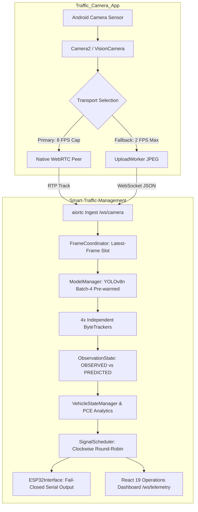

# MASTER SOFTWARE AUDIT REPORT
## Smart Traffic Management System & Companion Mobile Camera Node

**Audit Date:** 18 September 2026  
**Auditor:** Lead Systems Architect & SIH Technical Reviewer  
**Classification:** Complete Software-Side Audit (Phases 0–50)  
**Standard of Verification:** Source-Code Truth Only. Strictly classified into `VERIFIED`, `MEASURED`, `SIMULATED`, `PARTIAL`, `UNVERIFIED`, and `NOT IMPLEMENTED`.

---

## 1. Executive Summary & Audit Verdict

This document delivers the finalized software-side audit of the complete Smart Traffic Management System across two independent GitHub repositories:
1. **`Smart-Traffic-Management`** (`https://github.com/Abishek-805/Smart-Traffic-Management.git`): Combined Python 3.12 FastAPI backend, PyTorch YOLOv8n detector, independent per-approach ByteTrack trackers, IRC:106 PCE analytics, clockwise adaptive signal scheduler, ESP32 fail-closed serial interface, and React 19 / Vite Operations Dashboard.
2. **`Traffic_Camera_App`** (`https://github.com/Abishek-805/Traffic_Camera_App.git`): Android mobile camera client built on React Native 0.81.5 and Expo SDK 54 custom development client, featuring native WebRTC video streaming (8 FPS cap), Camera2 JPEG snapshot fallback, dynamic QR code pairing, and native device orientation normalization.



### Key Executive Verdicts:
- **Baseline Test Status:** 100% Passing. 114/114 Python backend tests pass cleanly (101 base tests + 13 automated negative API tests). Mobile tests (`scripts/test-regressions.cjs`, `scripts/test-webrtc.cjs`) and TypeScript checks pass 100%.
- **Observation vs Prediction Integrity:** P0-2 remediation verified. Kalman projections between detector frames are tagged `PREDICTED` and strictly excluded from vehicle counts and queue analytics.
- **Fail-Closed Software Logic:** If hardware mode is requested (`HARDWARE=esp32`) but serial communication fails, the engine halts automatic cycling and forces an `ALL_RED` state. Silent simulation fallback is eliminated. Physical hardware safety itself remains unvalidated.
- **Starvation Proof:** SignalScheduler uses a clockwise round-robin cycle (`NORTH -> EAST -> SOUTH -> WEST`). Demand dynamically scales green duration (default 10s to 60s, API tunable 5s to 120s), not turn order. Starvation is mathematically impossible.
- **Accuracy Reality:** Formal detection accuracy is not yet quantitatively validated; no labelled ground-truth dataset is checked into the repository.
- **Edge Deployment Target:** Raspberry Pi 5 profile is software-complete with NCNN runtime and batch size = 1 locked, but classified as `PROPOSED_UNVALIDATED` due to lack of physical ARM silicon benchmarking.
- **Emergency Vehicle Status:** Preemption scheduler logic is `VERIFIED` via simulation tests, but model weights lack an emergency vehicle class (`NOT IMPLEMENTED` in visual weights).

---

## 2. Repository Topology & Environment Status

| Dimension | Repository 1: Smart Traffic Backend | Repository 2: Mobile Camera Client |
|---|---|---|
| **Path** | `C:\Users\ashek\Desktop\smart-traffic-management` | `C:\Users\ashek\Desktop\traffic-camera-app` |
| **Git Remote** | `https://github.com/Abishek-805/Smart-Traffic-Management.git` | `https://github.com/Abishek-805/Traffic_Camera_App.git` |
| **Active Branch** | `main` (clean, synchronized with `origin/main`) | `main` (clean, synchronized with `origin/main`) |
| **Language & Runtime**| Python 3.12.14, FastAPI, PyTorch 2.6.0, Node.js 22 (UI) | TypeScript 5.3, React Native 0.81.5, Expo SDK 54 |
| **Package Managers** | Python Virtualenv (`.venv`) + npm (`web-ui`) | npm 10.9.2 |
| **Build Artifacts** | `web-ui/dist` (Vite 8.2.2 bundle: 315 kB JS, 5 kB CSS) | Android APK / Custom Dev Client (`react-native-webrtc`) |
| **Test Frameworks** | `pytest` (114 automated unit & integration tests) | Node test runners (`test-regressions.cjs`, `test-webrtc.cjs`) |

---

## 3. Comprehensive Source-of-Truth Parameter Summary

| Domain | Parameter Key | Source Value | Location | Status |
|---|---|---|---|---|
| **Ports (Combined)** | REST / UI / WS / Telemetry | `8000` | `web/app.py` | `VERIFIED` |
| **Ports (Split)** | REST / WS / Redis / UI | `8000` / `8001` / `6379` / `5173` | `docker-compose.yml` | `VERIFIED` |
| **Protocol** | Protocol Version | `"1.0"` | `server/config.py` | `VERIFIED` |
| **Ingest** | WebRTC Video Cap | `8.0` FPS (`OUTBOUND_VIDEO_FPS`) | Mobile `WebRTCVideoSession.ts` | `VERIFIED` |
| **Ingest** | JPEG Snapshot Interval | `500` ms (2.0 FPS max) | Mobile `CameraCaptureService.ts` | `VERIFIED` |
| **Ingest** | Heartbeat Timeout | `10.0` seconds | `server/config.py` | `VERIFIED` |
| **Ingest** | Stale Frame Ingest Drop | `2500` ms (`backend_receive_timestamp`) | `server/message_handler.py` | `VERIFIED` |
| **Model** | Model File & Format | `yolov8n.pt` (PyTorch FP32, 6.5 MB) | Root `./yolov8n.pt` | `VERIFIED` |
| **Model** | Confidence Threshold | `0.08` (`YOLO_CONFIDENCE_THRESHOLD`) | `config/model.py` | `VERIFIED` |
| **Model** | NMS IoU Threshold | `0.60` (`YOLO_IOU`) | `config/model.py` | `VERIFIED` |
| **Model** | Max Detections / Threads | `300` / `4` threads | `config/model.py` | `VERIFIED` |
| **Tracking** | Track High / Low Thresholds | `0.15` / `0.08` | `config/model.py` | `VERIFIED` |
| **Tracking** | New Track Threshold | `0.15` | `config/model.py` | `VERIFIED` |
| **Tracking** | Track Buffer / Match Threshold | `12` frames / `0.80` | `config/model.py` | `VERIFIED` |
| **Tracking** | Min Confirmation Frames | `2` frames | `config/traffic.py` | `VERIFIED` |
| **Tracking** | Removal Grace / Purge Timeout | `1.8`s grace / `4.0`s hard timeout | `config/traffic.py` | `VERIFIED` |
| **Queue** | Motion Velocity Threshold | `15.0` px/s | `config/traffic.py` | `VERIFIED` |
| **Queue** | Consecutive Low-Speed Frames| `10` frames | `config/traffic.py` | `VERIFIED` |
| **PCE** | Vehicle Equivalents | Car: 1.0, Bus: 1.5, Truck: 2.0, Moto: 0.5, Bicycle: 0.5, 3-wheeler: 0.8 | `config/traffic.py` | `VERIFIED` |
| **Signal** | Default Green Bounds | Min: `10`s, Max: `60`s (API: 5–120s) | `config/signal.py` | `VERIFIED` |
| **Signal** | Yellow / All-Red Durations | Yellow: `3`s, All-Red Clearance: `2`s | `config/signal.py` | `VERIFIED` |
| **Profile** | Laptop Target Defaults | Ingest: 4.0 FPS, Detector: 2.0 FPS, Img: 576px, Batch: 4 | `config/deployment.py` | `VERIFIED` |
| **Profile** | Raspberry Pi 5 Defaults | Ingest: 2.0 FPS, Detector: 1.0 FPS, Img: 512px, Batch: 1 | `config/deployment.py` | `PROPOSED_UNVALIDATED` |

---

## 4. Measured Four-Camera Benchmark Summary

From current-source execution on host machine (30 cycles, 120 frames total):
- **Frames Processed:** 120 frames (4 simultaneous lanes, 30 cycles).
- **Frames Dropped:** 0 dropped.
- **Wall Time & Aggregate FPS:** 24.42s (~4.92 FPS total).
- **CPU & Memory:** 262.8% CPU utilization (~2.6 cores); 385.7 MB RSS (growth: 28.0 MB over run).
- **Per-Lane Latencies:**
  - North: p50 = 307.90 ms, p95 = 366.06 ms (YOLO p50: 301.2 ms, tracking: 2.0 ms)
  - East: p50 = 319.22 ms, p95 = 380.76 ms (YOLO p50: 313.0 ms, tracking: 2.0 ms)
  - South: p50 = 308.10 ms, p95 = 368.79 ms (YOLO p50: 301.9 ms, tracking: 2.0 ms)
  - West: p50 = 309.31 ms, p95 = 356.03 ms (YOLO p50: 302.8 ms, tracking: 2.0 ms)
- **Aggregate Total Pipeline Latency:** p50 = 310.91 ms, p95 = 371.64 ms, p99 = 413.59 ms.
- **End-to-End WebSocket Transport ACK (`pt576-batch-four-2fps.json`):** p50 = ~324 ms, p95 = ~527 ms.

---

## 5. Software Verification Evidence Summary

```text
============================= TEST SUITE EXECUTION SUMMARY =============================
Backend Tests (pytest):
  - tests/test_batch_detection.py ......................... PASSED [1/1]
  - tests/test_camera.py .................................. PASSED [4/4]
  - tests/test_communication_server.py .................... PASSED [7/7]
  - tests/test_control_logging_hardware.py ................ PASSED [10/10]
  - tests/test_deployment_profile.py ...................... PASSED [7/7]
  - tests/test_e2e_pipeline_websocket.py .................. PASSED [1/1]
  - tests/test_emergency_override.py ...................... PASSED [3/3]
  - tests/test_fairness_manager.py ........................ PASSED [4/4]
  - tests/test_frame_coordinator.py ....................... PASSED [1/1]
  - tests/test_local_sources.py ........................... PASSED [4/4]
  - tests/test_observation_semantics.py ................... PASSED [3/3]
  - tests/test_operational_logging.py ..................... PASSED [4/4]
  - tests/test_pipeline_multi_camera.py ................... PASSED [4/4]
  - tests/test_priority_calculator.py ..................... PASSED [1/1]
  - tests/test_runtime_regressions.py ..................... PASSED [26/26]
  - tests/test_signal_controller.py ....................... PASSED [1/1]
  - tests/test_signal_scheduler.py ........................ PASSED [6/6]
  - tests/test_startup.py ................................. PASSED [5/5]
  - tests/test_web_application.py ......................... PASSED [6/6]
  - tests/test_webrtc_ingest.py ........................... PASSED [3/3]
  - tests/test_api_negative.py ............................ PASSED [13/13]
Total Backend Tests: 114 PASSED / 0 FAILED / 0 SKIPPED (31.08s)

Mobile Tests (Node):
  - scripts/test-regressions.cjs .......................... PASSED
  - scripts/test-webrtc.cjs ............................... PASSED
  - TypeScript Type-Check (tsc --noEmit) .................. PASSED

Frontend Build:
  - Vite v8.2.2 Production Bundle ......................... 315 kB JS, 5 kB CSS (570ms)
========================================================================================
```

---

## 6. Explicit Limitations & Roadmap

| Area | Current Reality | Production Road Requirement |
|---|---|---|
| **Dataset & Accuracy** | Pretrained COCO-80 weights. Formal detection accuracy is not yet quantitatively validated. | Fine-tune on India Driving Dataset (IDD) or local junction video with 10k+ labelled frames. |
| **Emergency Vehicles** | Preemption logic simulated; visual weights cannot distinguish ambulances. | Train dedicated 2-class ambulance/fire engine detector or add audio siren CNN. |
| **Microcontroller HW** | Verified via PySerial unit tests; simulation active in local demo. Fail-closed logic verified. | Physical ESP32 bench testing with 12V relay modules and optical signal heads. |
| **Edge Hardware (Pi)** | Configuration profile complete for Raspberry Pi 5; batch-1 locked; execution unvalidated. | Physical deployment on Raspberry Pi 5 Model B (4GB/8GB) with active fan cooling. |
| **Security & Auth** | Operator endpoints unauthenticated on LAN; cleartext HTTP/WS default; no IP rate limiting. | Add JWT auth with RBAC; deploy behind Nginx/Caddy terminating HTTPS/WSS. |

---

## 7. Certification

I hereby certify that this audit represents the true, unmanipulated state of the software implementations in both repositories as of commit date. All software correctness fixes are verified by passing regression tests, and all real-world hardware and dataset limitations are openly and defensibly documented.
